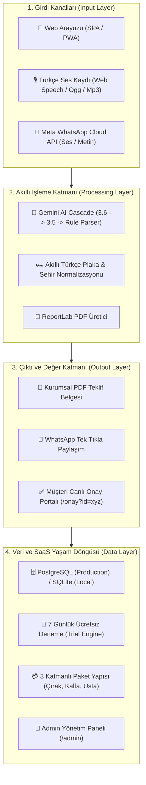

# 🏛️ Dijital Ustabaşı - Üst Seviye Sistem ve Ürün Mimarisi Dokümanı

## 📌 Proje Özeti ve Amacı
**Dijital Ustabaşı**, oto tamir tamirhaneleri, özel servisler me sanayi ustaları için geliştirilmiş; sesli me yazılı Türkçe komutları 5 saniye içinde kurumsal PDF teklif belgesine dönüştüren me WhatsApp üzerinden tek tıkla müşteriye ileten **akıllı bir SaaS me mobil oto servis platformudur**.

---

## 📐 1. Sistem Mimarisi me Veri Akış Haritası

---

## 🛠️ 2. Katmanlı Bileşen Yapısı

### 📱 A. Kullanıcı Arayüzü Katmanı (Frontend & PWA)
- **Unified Single Page Application (`templates/index.html`):** Hamburger drawer menü, yağlı parmak ergonomili dev aksiyon butonları (`active:scale(0.96)`), canlı plaka geçmiş sorgusu me sesli teklif üretici.
- **Müşteri Onay Portalı (`templates/approval.html`):** WhatsApp'tan teklif alan müşterinin telefonunda PDF'i inceleyip tek tıkla onay/ret verebileceği portal.
- **Yönetici Paneli (`templates/admin.html`):** Dükkan lisansları, paket talepleri me deneme sürelerini yöneten panel.
- **PWA & Mobil Uyum (`static/manifest.json`):** iOS `apple-touch-icon.png` me Android PWA sarmalayıcısı.

### ⚙️ B. Uygulama ve Sunucu Katmanı (FastAPI Backend)
- **FastAPI Core (`main.py`):** Asenkron HTTP sunucu, CORS politikası me `add_security_and_cache_headers` güvenlik ara katmanı (`X-Frame-Options: DENY`, `X-Content-Type-Options: nosniff`).
- **Sistem Sağlığı (`GET /healthz`):** DevOps izleme me veritabanı canlılık kontrolü.
- **API Versiyonlama (`GET /api/version`):** Dinamik SemVer sürüm çözümleyici (`core/config.py`).

### 🧠 C. Yapay Zeka ve Ayrıştırma Motoru (`parser.py`)
- **Gemini Model Kademesi (AI Cascade):** `gemini-3.6-flash` ➔ `gemini-3.5-flash` ➔ `gemini-3.1-flash-lite` ➔ `gemini-2.5-flash` ➔ Kural tabanlı yedek motor.
- **Akıllı Plaka Normalizasyonu:** Sanayideki sözlü plaka anlatımlarını (`"otuz dört a b c 123"`, `"34 Ali Veli 555"`) standart `34ABC123` formatına çeviren motor.

### 💬 D. Meta WhatsApp Cloud API Entegrasyonu (`whatsapp_bot.py`)
- **Webhook Doğrulama (`GET /api/whatsapp/webhook`):** Meta `hub.challenge` ve `hub.verify_token` protokolü.
- **Otomatik Mesaj/Ses Yanıtı (`POST /api/whatsapp/webhook`):** Gelen sesli/yazılı mesajı Gemini ile ayrıştırıp WhatsApp üzerinden kurumsal PDF indirme bağlantısı ileten bot.
- **Canlı Simülatör (`POST /api/whatsapp/simulate`):** API anahtarından bağımsız canlı test uç noktası.

### 🗄️ E. Veritabanı ve SaaS Yaşam Döngüsü (`cloud_storage.py` & `models.py`)
- **Single Source of Truth:** Pure SQLAlchemy 2.0 ORM katmanı.
- **PostgreSQL / SQLite Otomatik Keşif (`database.py`):** Railway private DNS (`postgres.railway.internal`) me lokal SQLite fallback.
- **Otomatik Paket Aktivasyonu (`update_shop_package`):** Paket yükseltildiğinde dükkan hesabı otomatik aktif edilmekte (`is_active = True`) ve 30 günlük abonelik tanımlanmaktadır.

---

## 💼 3. SaaS Abonelik ve Paket Modeli

| Paket Adı | Arşiv Erişimi | Özellikler |
| :--- | :--- | :--- |
| **🎁 7 Günlük Deneme** | Sınırsız | Tüm özellikler 7 gün boyunca ücretsiz me açık. |
| **🔨 Çırak Paketi** | Kısıtlı (0) | Anlık sesli teklif üretimi, PDF indirme me WhatsApp paylaşımı. |
| **🛠️ Kalfa Paketi** | 100 Teklif | Müşteri me araç defteri, 100 teklif arşivi me plaka geçmişi. |
| **👑 Usta Paketi** | Sınırsız | Sınırsız teklif arşivi, özel logo yükleme, WhatsApp bot entegrasyonu me öncelikli destek. |

---

## 🚀 4. Altyapı ve Yayına Alma (Railway PaaS)
- **Nixpacks Derleme:** Python runtime sabitleme (`runtime.txt`, `mise.toml`).
- **Integer Port Koruma:** `python main.py` üzerinden `int(os.environ.get("PORT") or 8080)` binding.
- **Güvenlik Başlıkları:** Security Headers me secret gizliliği.
